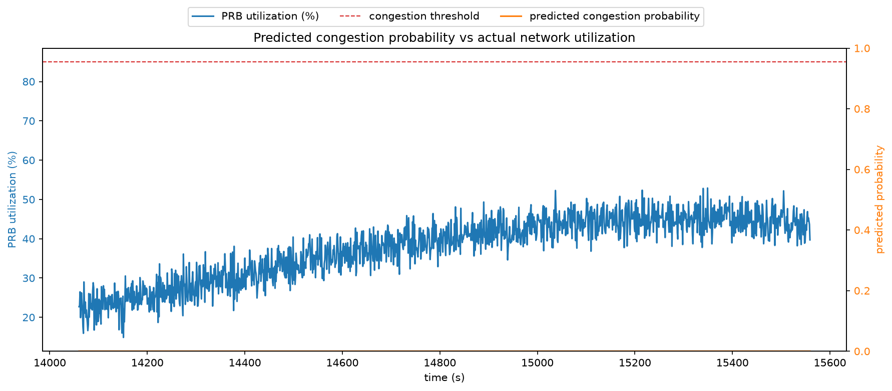

# PQPE - Predictive QoS Preemption Engine

A machine learning system that predicts 5G network congestion before it happens, so that emergency first-responder traffic can be given priority bandwidth proactively rather than reactively.

## Problem

During large-scale emergencies (fires, natural disasters, mass-casualty incidents), civilian smartphone usage spikes sharply as people call, text, and stream from the affected area. This overwhelms local cell towers right when first responders most need reliable bandwidth for body-cam video, telemetry, and voice coordination.

Existing solutions (AT&T FirstNet, T-Mobile T-Priority, Verizon FrontLine) are reactive: they elevate emergency traffic priority only after congestion has already begun. None of them forecast congestion before it occurs.

## Approach

This project models the prediction problem as a time-series binary classification task: given the last 60 seconds of network telemetry, will the cell become congested in the next 60 seconds?

The key insight is that network congestion has leading indicators. During real emergencies, social media activity and emergency call volume in an area tend to rise slightly before the network itself becomes saturated, since people start reacting to an incident before everyone simultaneously opens their phone. A model that incorporates these signals alongside raw network KPIs can catch the pattern earlier than one relying on network telemetry alone.

### Why synthetic data

There is no public dataset combining cell-level RAN telemetry with emergency call volume and social signals at second-level granularity, since this kind of data is operator-confidential. To validate the approach, this project generates a synthetic dataset that mimics the structure described above: a baseline of normal daily traffic patterns, with emergency-style congestion events injected at random points in time, each event following a lead-in -> ramp -> peak -> decay shape.

This is a common and accepted approach for early-stage prototyping in domains where real data is inaccessible. The model and pipeline are designed to be retrained on real RAN/PSAP/social telemetry without modification, once such data is available.

## What the model predicts

Given a 60-second window of six telemetry signals - PRB (Physical Resource Block) utilization, active connected devices, downlink throughput, signal quality (SINR), E911 call volume, and a social media activity proxy - the model outputs a single probability: the likelihood that the cell will cross a congestion threshold (85% PRB utilization) within the next 60 seconds.

## Architecture

```
generate_data.py   ->  telemetry.csv   ->   train_lstm.py   ->   pqpe_lstm.pt
(synthetic data)        (raw signals)      (LSTM classifier)    (trained model)
```

### Data generation (`generate_data.py`)

Simulates 20,000 seconds (about 5.5 hours) of telemetry for a single cell site:

- Baseline traffic follows a smooth daily-style cycle with noise, representing normal usage.
- 35 emergency events are injected at random non-overlapping points, each with four phases:
  - Lead-in: social media and E911 signals rise first
  - Ramp: network utilization and device count climb
  - Hold: peak congestion sustained for several minutes
  - Decay: gradual return to baseline
- Every timestep is labeled `1` if congestion (>=85% PRB utilization) occurs at any point in the following 60 seconds, otherwise `0`.

### Model (`train_lstm.py`)

A two-layer LSTM (Long Short-Term Memory network) processes 60-second sliding windows of the six input signals and outputs a congestion probability via a linear classification head.

Design choices:
- **Chronological train/test split** (70/30) rather than random shuffling, since the model should only ever be evaluated on data that comes after what it trained on - this avoids leaking future information into training.
- **Feature normalization** computed from training data statistics only, applied to both splits.
- **Class-weighted loss** (`BCEWithLogitsLoss` with `pos_weight`) to account for congestion events being a minority class.
- Evaluation tracked via precision, recall, F1, and AUC rather than accuracy alone, since accuracy is misleading on imbalanced data.

## Setup

```bash
pip install torch scikit-learn pandas numpy
python generate_data.py
python train_lstm.py
```

Training prints per-epoch metrics and saves the best-performing checkpoint (by F1 score) to `pqpe_lstm.pt`, along with the normalization statistics needed for inference on new data.

## Repository structure

```
.
├── assets/
│   ├── PQPE_Proposal.pdf      # project proposal document
│   └── prediction_plot.png    # generated by plot_predictions.py
├── generate_data.py            # synthetic telemetry generator
├── train_lstm.py                # LSTM training and evaluation
├── baseline_comparison.py      # non-ML baseline comparison
├── plot_predictions.py          # visualizes predictions vs actual congestion
├── telemetry.csv                # pre-generated sample dataset
├── requirements.txt
├── README.md
└── .gitignore
```

The editable `.docx` source of the proposal is kept locally in `assets/` but excluded from version control; only the PDF is tracked.

## How to run

Clone the repo and install dependencies:

```bash
git clone https://github.com/<your-username>/<your-repo>.git
cd <your-repo>
pip install -r requirements.txt
```

Generate the synthetic dataset (already included as `telemetry.csv`, but you can regenerate or tune it):

```bash
python generate_data.py
```

Train the model:

```bash
python train_lstm.py
```

This prints per-epoch precision, recall, F1, and AUC on the held-out test split, and saves the best checkpoint to `pqpe_lstm.pt` along with the normalization statistics needed for inference.

## Results

Trained for 15 epochs on the synthetic dataset (20,000 timesteps, 35 injected congestion events, 70/30 chronological train/test split). Metrics below are from the best-performing epoch by F1 score, evaluated on the held-out test set:

| Metric | Score |
|---|---|
| Precision | 0.898 |
| Recall | 0.957 |
| F1 | 0.932 |
| AUC | 0.991 |

Confusion matrix at this checkpoint, on 5,941 test windows:

| | Predicted: no congestion | Predicted: congestion |
|---|---|---|
| **Actual: no congestion** | 3,250 (TN) | 408 (FP) |
| **Actual: congestion** | 52 (FN) | 2,231 (TP) |

The model misses only 52 of 2,283 actual congestion windows in the test set (97.7% recall). In an emergency-response context a missed congestion event is far more costly than a false alarm, so this recall-heavy error profile is the right tradeoff.

### Baseline comparison

To check that the LSTM is adding value over a simpler approach, it is compared against two non-ML baselines on the same test split:

| Approach | Precision | Recall | F1 |
|---|---|---|---|
| Always predict no congestion | 0.0 | 0.0 | 0.0 |
| Reactive threshold rule (current PRB utilization >= 75%) | 0.930 | 0.872 | 0.900 |
| **LSTM (this project)** | **0.898** | **0.957** | **0.932** |

The threshold rule represents what a purely reactive system effectively does: it can only flag congestion once utilization is already elevated, with no lead time and no use of the E911 or social signal data. The LSTM's advantage comes mainly from higher recall, catching more real congestion events earlier by using the leading-indicator signals rather than waiting for the network itself to show strain.

Run the comparison yourself:

```bash
python baseline_comparison.py
```

### Visualizing predictions

After training, generate a plot of predicted congestion probability against actual network utilization over time:

```bash
python plot_predictions.py
```

This produces `assets/prediction_plot.png`, showing the predicted probability rising ahead of actual PRB utilization crossing the congestion threshold.



## Limitations and next steps

This is a prototype built to validate the prediction approach, not a production system. Known limitations:

- Trained and evaluated entirely on synthetic data; real-world performance is unknown until validated on actual network telemetry. The strong metrics above reflect a clean, engineered signal pattern and should not be read as a claim about real-world accuracy.
- The decision layer (mapping a congestion probability to a specific throttling or slice-provisioning action) is not yet implemented.
- No live/streaming inference pipeline; the current scripts operate on a static CSV rather than a real-time feed.

Planned extensions:
- A rule-based decision module that maps prediction confidence to graduated response tiers (bandwidth throttling, then dedicated slice provisioning).
- A live dashboard visualizing real-time predictions against an animated telemetry feed.
- Feature-attribution analysis (e.g. SHAP) to explain individual predictions for human operators.

## Background

This project is based on a research proposal exploring ML-driven proactive network slicing for emergency communications within an O-RAN (Open Radio Access Network) architecture, drawing on 3GPP 5G QoS and network slicing standards. This repository implements and validates the core predictive component of that proposal.
